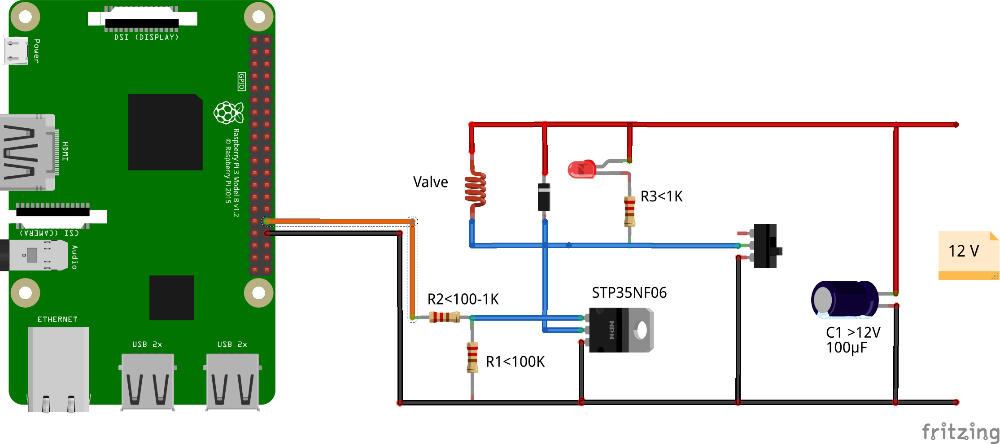

# CATATTAC

My version of great https://norris.org.au/cattack/ just to keep the neighbours cats away :)
in case of detected motion the intruder gets recorded with pictures and/or videos. A script is triggered by the motioneye software. This script waits some seconds to give the cat time to sit down. Then the script opens the valve of the waterhose and the cat gets showered. A picture of the running cat can be send to me by telegram messenger.


 
Setup:

Raspberry Pi2 or Pi3 with motioneyeos https://github.com/ccrisan/motioneyeos

IP Cam(s)

A garden

Neighbours cats

Solenoid valve (for switching the water on and off) + Powersupply

Waterhose




The script:
```
#!/usr/bin/python                                                               

# Originally from https://norris.org.au/cattack/
# import libraries                                                              
import RPi.GPIO as GPIO                                                         
import time                                                                     
                                                                                
GPIO.setwarnings(False)                                                         
                                                                                
# use Pi board pin numbers                                                      
GPIO.setmode(GPIO.BOARD)                                                        
                                                                                
# configure the pin for output                                                  
GPIO.setup(12, GPIO.OUT)                                                        
                                                                                
# P1_12 == 12 == GPIO1 == GPIO18                                                
# How did they mess up the pin numbering so badly!!                             
                                                                                
# Turn on the sprinkler for 5 seconds                                           
# the motion program has a 60 seconds "cooldown"                                
time.sleep(5)                                                                   
GPIO.output(12, GPIO.HIGH)                                                      
time.sleep(5)                                                                   
GPIO.output(12, GPIO.LOW) 
```

To send the pic using telegram bot:

```
curl -s -X POST "https://api.telegram.org/<Bot_token>/sendPhoto" -F chat_id=<chat_ID> -F photo="@/data/output/Camera3/cat.jpg" -F caption="gotcha!!!"
```


